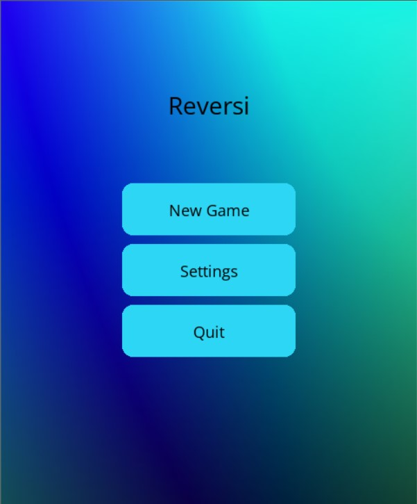

**Othello Game with AI Opponent**

  <h1><strong>Othello Game with AI Opponent using minimax algorithm</strong></h1>

**Overview**

**Game Rules**

Othello, also known as Reversi, is a strategy board game played on an 8x8 grid. The game involves two players, one playing with black discs and the other with white. The objective is to have the majority of discs turned to display your color by the end of the game. The game starts with four discs placed in the center of the board in a square pattern: two black and two white, with each player having two discs placed diagonally.

**How the Game is Played**

1.  **Players**: Two players (one can be AI).
2.  **Turns**: Players take turns placing discs on the board.
3.  **Valid Moves**: A valid move must outflank one or more of the opponent's discs. Outflanking means to sandwich one or more of the opponent's discs between two of the player's discs along a row, column, or diagonal.
4.  **Flipping Discs**: When a valid move is made, all the opponent's outflanked discs are flipped to the player's color.
5.  **End of Game**: The game ends when neither player can make a valid move. The player with the most discs of their color on the board wins.

**Implementation Details**

**Initial Setup**

-   **Pygame Initialization**: The Pygame library is initialized, including the mixer for playing background music.
-   **Window Setup**: A window is created with dimensions based on the board size and additional panel height for UI elements.
-   **Color Scheme**: Colors for various UI elements like the board, valid moves, buttons, and text are defined.
-   **Fonts and Images**: Custom fonts and background images are loaded for a better visual experience.

    **Game Components**

-   **Board Initialization**: The init_board() function initializes the board to its starting state with four discs in the center.
-   **Menu and Settings**: The game includes a main menu, mode selection menu (two-player, AI), and settings menu (for toggling sound and selecting difficulty).

    **Game Loop**

-   **Drawing the Board**: The draw_board() function handles rendering the board, the discs, valid move indicators, and UI elements.
-   **Move Validation and Application**: Functions is_valid_move(), apply_move(), and get_all_valid_moves() are used to validate and apply player moves, ensuring the game rules are followed.
-   **Game Over Check**: The is_game_over() function checks if no valid moves are left for both players, indicating the end of the game.
-   **Winner Display**: The display_winner() function shows the winner and final score when the game ends.

    **User Interaction**

-   **Mouse Input**: The game handles mouse clicks for selecting moves and interacting with menu buttons.
-   **Event Handling**: Pygame events such as quitting the game, mouse clicks, and key presses are managed in the main game loop and menus.

**Minimax Algorithm with Alpha-Beta Pruning**

**Overview**

The Minimax algorithm is a decision-making algorithm used in two-player games to minimize the possible loss in a worst-case scenario. It simulates all possible moves and their outcomes to choose the optimal move. Alpha-beta pruning is an optimization technique that reduces the number of nodes evaluated in the Minimax algorithm by eliminating branches that won't affect the final decision.

**Minimax Algorithm**

-   **Purpose**: To find the best move for the AI by evaluating potential future states of the board.
-   **Depth**: The algorithm explores the game tree up to a certain depth to balance between performance and accuracy.
-   **Maximizing and Minimizing**: The algorithm alternates between maximizing the AI's advantage and minimizing the opponent's advantage.

**Implementation**

1.  **Recursion**: The minimax() function calls itself recursively, alternating between maximizing and minimizing player.
2.  **Base Case**: The recursion stops when a specified depth is reached or the game is over. The score is then calculated based on the difference in disc counts.
3.  **Score Calculation**: For each move, the board state is updated, and the Minimax function is called recursively to get the score of the resulting state.
4.  **Move Selection**: The best move is selected based on the highest score for maximizing player (AI) or the lowest score for minimizing player (human).

**Alpha-Beta Pruning**

-   **Alpha (α)**: The best score the maximizing player can guarantee so far.
-   **Beta (β)**: The best score the minimizing player can guarantee so far.
-   **Pruning**: If the current move cannot improve the player's score beyond the known best score (alpha or beta), further exploration of that move is skipped.

**Explanation**

-   **Recursion and Depth**: The function recurses until the maximum depth is reached or the game is over. At each level, it evaluates the potential moves and their outcomes.
-   **Maximizing and Minimizing**: The algorithm alternates between maximizing the AI's score and minimizing the opponent's score.
-   **Alpha-Beta Pruning**: The alpha and beta values are updated to keep track of the best scores and to prune branches that cannot lead to better outcomes.

**Conclusion**

This Othello game implementation provides a comprehensive interactive experience with a user-friendly interface, multiple game modes, and a challenging AI opponent. The Minimax algorithm with alpha-beta pruning ensures efficient and optimal decision-making for the AI, making the game competitive and engaging. The code structure is modular and organized, facilitating easy maintenance and potential enhancements.
